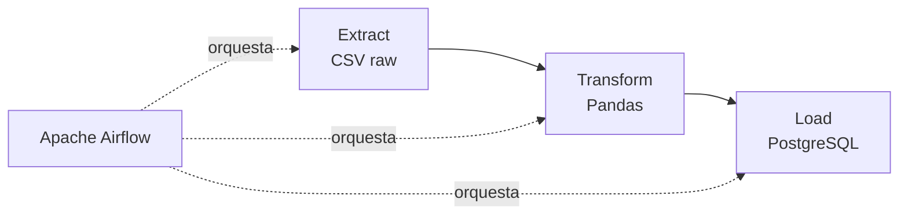
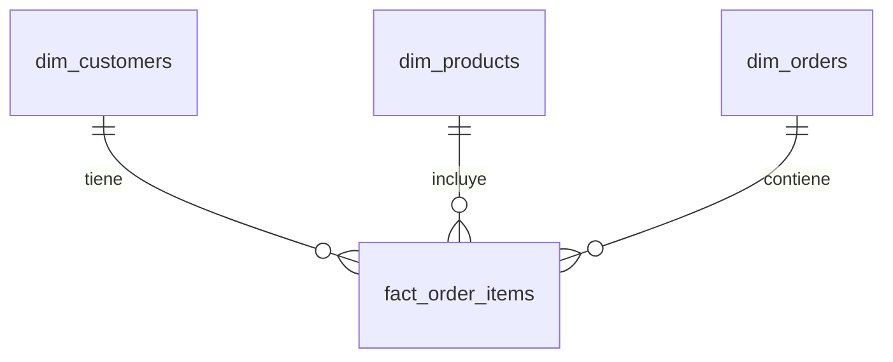
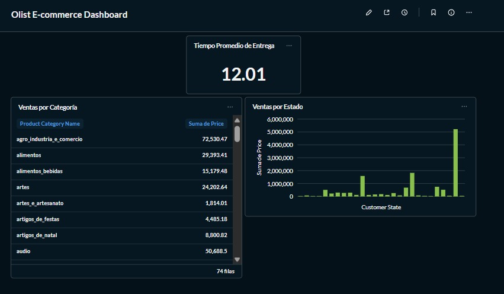

# 📦 E-commerce ETL Pipeline (Olist Dataset)

Pipeline de ingeniería de datos end-to-end que extrae, transforma y carga datos de e-commerce brasileño, orquestado con Apache Airflow.

**Autor:** Christopher

## 🎯 Objetivo

Construir un pipeline ETL productivo que procese datos transaccionales de e-commerce (pedidos, clientes, productos, pagos) y los modele en un esquema estrella listo para análisis de negocio (ventas por región, tiempos de entrega, categorías más vendidas, etc.).

## 🏗️ Arquitectura



**Modelo de datos (esquema estrella):**



## 🛠️ Stack técnico

- **Python + Pandas** — extracción y transformación
- **PostgreSQL** — data warehouse
- **Apache Airflow** — orquestación del pipeline (DAG diario)
- **Docker / Docker Compose** — contenerización de todos los servicios

## 📊 Dataset

[Brazilian E-Commerce Public Dataset by Olist](https://www.kaggle.com/datasets/olistbr/brazilian-ecommerce) — ~100K pedidos reales de e-commerce en Brasil (2016-2018).

Aquí está, envuelta correctamente en un bloque de código para que GitHub respete la indentación y los saltos de línea:

## 📁 Estructura del proyecto

```
ecommerce-etl-pipeline/
├── data/
│   ├── raw/           # CSVs originales (descargar de Kaggle, no incluidos en el repo)
│   └── processed/     # Datos limpios generados por el pipeline
├── src/
│   ├── transform.py   # Limpieza y modelado de datos
│   └── load.py        # Carga a PostgreSQL
├── dags/
│   └── etl_dag.py     # DAG de Airflow
├── docker-compose.yml
└── README.md
```

## 🚀 Cómo correrlo

1. Clona el repo y descarga el [dataset de Kaggle](https://www.kaggle.com/datasets/olistbr/brazilian-ecommerce), colocando los CSVs en `data/raw/`

2. Levanta los servicios:
```bash
   docker compose up -d
```

3. Crea la base de datos interna de Airflow (solo la primera vez):
```bash
   docker exec -it ecommerce_postgres psql -U etl_user -d ecommerce_dw -c "CREATE DATABASE airflow_meta;"
   docker restart ecommerce_airflow
```

4. Obtén la contraseña del usuario admin:
```bash
   docker exec -it ecommerce_airflow cat /opt/airflow/standalone_admin_password.txt
```

5. Abre **http://localhost:8080** (usuario: `admin`, contraseña: la del paso anterior)

6. Activa y dispara el DAG `ecommerce_etl_pipeline`

## 🔍 Decisiones de diseño

- **Esquema estrella**: se eligió sobre una tabla única desnormalizada para facilitar consultas analíticas y evitar redundancia de datos de cliente/producto repetidos en cada línea de pedido.
- **Agregación de pagos**: un pedido puede tener múltiples pagos (cuotas, métodos combinados); se agregan por `order_id` para obtener el total pagado real.
- **Manejo de nulos**: fechas de entrega/aprobación ausentes se preservan como `NULL` en vez de eliminarse, ya que representan información real de negocio (pedidos cancelados o en tránsito).
- **LocalExecutor en Airflow**: se optó por una configuración simple (sin Celery/Redis) por ser un proyecto de portafolio, priorizando claridad sobre escalabilidad productiva.

## 📈 Ejemplo de consulta de negocio

```sql
SELECT customer_state, COUNT(*) as total_pedidos
FROM dim_orders o
JOIN dim_customers c ON o.customer_id = c.customer_id
GROUP BY customer_state
ORDER BY total_pedidos DESC
LIMIT 5;
```
## Captura de pantalla del grafo de Airflow


## 🔮 Posibles mejoras futuras

- Agregar tests de calidad de datos (Great Expectations) - Implementada
- Dashboard de visualización (Metabase / Streamlit) - Implementada
- Migrar a un data warehouse cloud (BigQuery / Snowflake)


## 📊 Capa de transformación (dbt) y visualización (Metabase)

Este proyecto extiende el pipeline original con una capa de transformación usando **dbt** y un dashboard interactivo con **Metabase**.

### dbt
- **Staging models**: `stg_customers`, `stg_orders`, `stg_products`, `stg_order_items` — limpieza y tipado de las tablas fuente.
- **Mart**: `fct_sales` — tabla analítica que une las 4 fuentes en un modelo listo para consumo.
- **Tests de calidad de datos**: validaciones `not_null` sobre columnas clave (`order_id`, `product_id`, `price`).
- **Documentación**: generada automáticamente con `dbt docs`, incluyendo el grafo de linaje de los modelos.
> **Orquestación:** dbt está integrado directamente en el DAG de Airflow. Cada corrida del pipeline ejecuta automáticamente `dbt run` y `dbt test` después de cargar los datos, incluyendo un paso previo (`drop_dbt_views`) que limpia las vistas dependientes antes de recrear las tablas fuente — evitando conflictos de dependencias en Postgres.

### Dashboard (Metabase)
Dashboard con 3 métricas clave del negocio:
- Ventas totales por estado
- Ventas totales por categoría de producto
- Tiempo promedio de entrega (días)



### Cómo correrlo
```bash
docker-compose up -d
```
Activa el DAG `ecommerce_etl_pipeline` en `http://localhost:8080` — dbt se ejecuta automáticamente como parte del pipeline. 
Luego entra a Metabase en `http://localhost:3000` y conecta la base `ecommerce_dw`.
